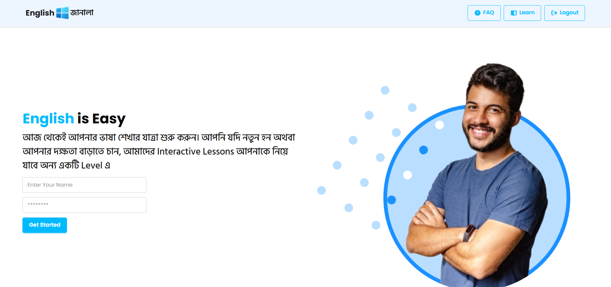
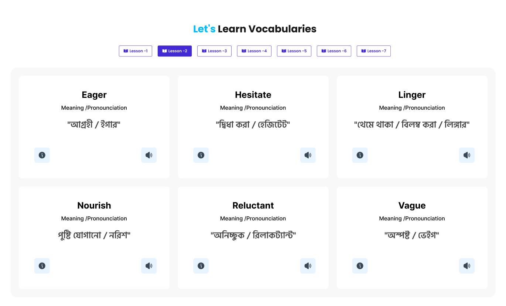
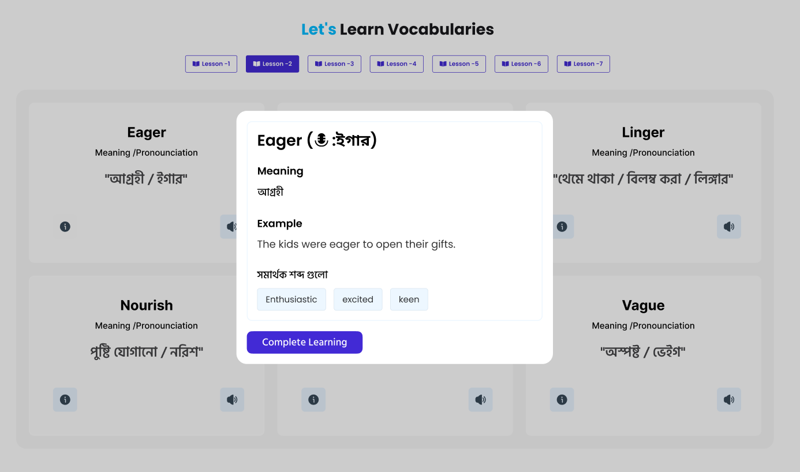
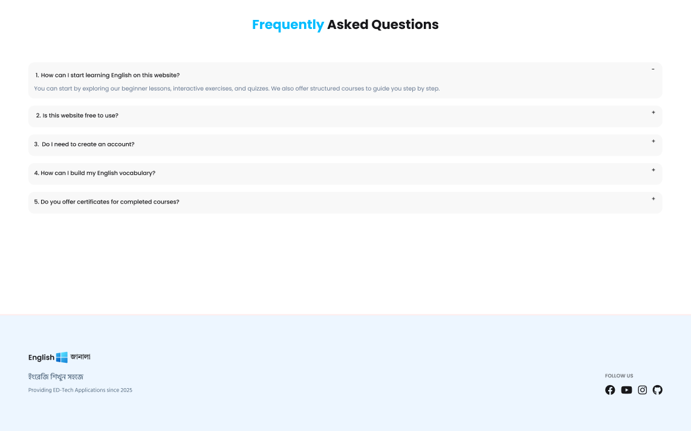

# English Janala
An interactive English learning web application designed to help users improve their vocabulary and understanding through structured lessons and simple explanations.

The project focuses on JavaScript DOM manipulation, event handling, and responsive UI design while building a real-world educational interface.

## 🔗 Live Link
https://mehedi-english-janala.netlify.app/

## 📌 Features
📚 Vocabulary learning section

📖 English & Bangla Pronounciation, Bangla Meaning & Synonyms system

🎯 Interactive lesson selection

❓ Frequently Asked Questions (FAQ)

📱 Responsive and user-friendly UI

⚡ Fast static website (no backend)


## 🛠️ Technologies Used

- HTML5

- CSS3

- JavaScript (ES6)

- DOM Manipulation

- Responsive Design


## 📂 Project Structure
 ``` base 
english-janala
│
├── index.html
├── style
│   └── style.css
├── js
│    └── script.js
├── assets
└── README.md 
``` 


## 🚀 How to Run Locally

1. Clone the repository

    ```
     git clone https://github.com/mehedi-hasan2006/english-janala.git  
     ```

2. Navigate to the project folder
    ``` 
    cd english-janala
    ```
3. Open `index.html` in your browser.


## 🎯 Purpose of This Project
The goal of this project is to practice JavaScript DOM manipulation, event handling, and responsive UI design while building a simple educational platform.

It demonstrates how interactive learning interfaces can be created using pure JavaScript without any frameworks or backend.

## 📸 Screenshots

<table>
    <tr>
        <td>
        
        </td>
        <td >
        
        </td>
    </tr>
    <tr>
        <td>
        
        </td>
        <td >
        
        </td>
    </tr>
    
</table>


## 🤝 Contributing
Contributions, issues, and feature requests are welcome.

If you would like to improve this project:

1. Fork the repository

2. Create a new branch

3. Make your changes

4. Submit a pull request


## 📄 License

This project is open source and available under the MIT License.

## 👨‍💻 Author

Mehedi Hasan

GitHub: https://github.com/mehedi-hasan2006

LinkedIn: https://www.linkedin.com/in/mehedi-hasan2006/